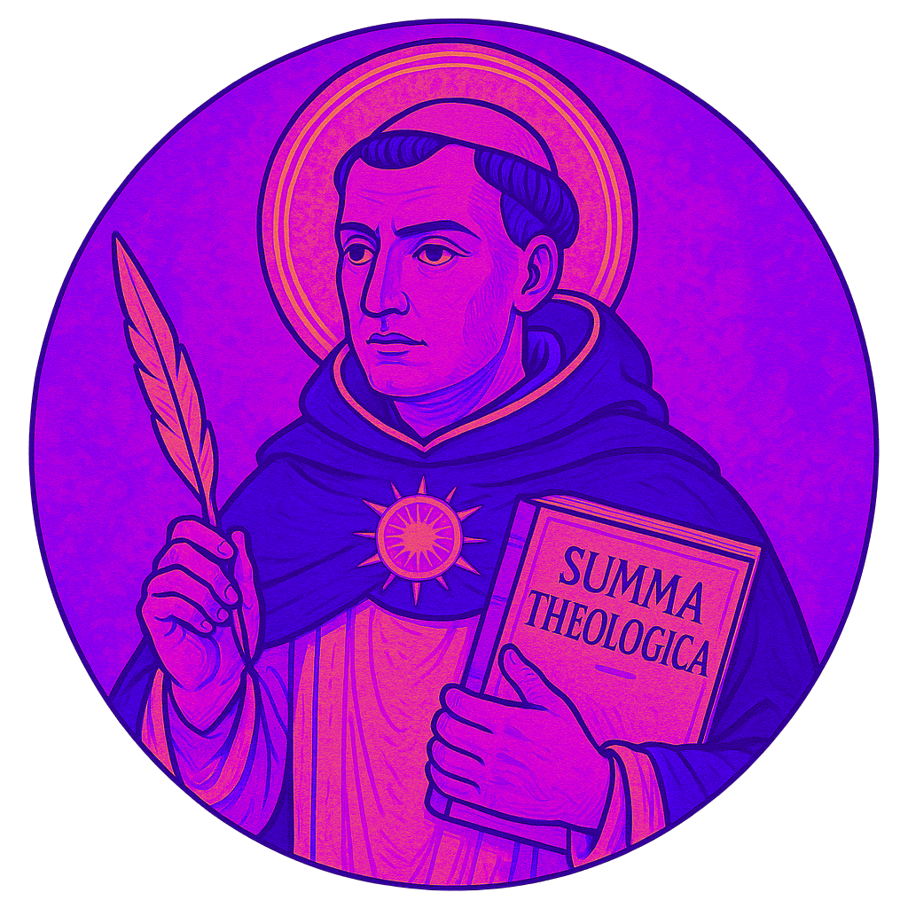

<h1 align="center">
 
Saint of the Day
</h1>

  

  RSOTD, or Rust Saint of the Day, is a very simple program that
  shows the currrent saint of the day in your terminal.

   

  The saints are based off the traditional calendar, so keep that in mind.

  A few things to note about the colors:

 <table>
 <td></td>
		<td>Red</td>
        <td>Martyrs</td>
 </table>

<h6 align="center">
All credit for colors and the color images to <a href="https://github.com/catppuccin/catppuccin">Catppuccin</a>
</h6>
